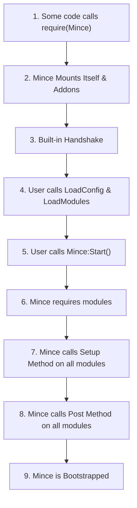

# Code Execution Model

The code execution model in Mince follows a specific, sequential boot process to ensure that all dependencies are loaded and ready before any game logic runs. 
This process prevents race conditions and provides structure for your project.

The boot process is as follows:

1.  **Require Mince**: The process begins when you `require()` the main Mince module. At this point, Mince mounts itself to `_G.MinceRef` and loads its internal addons.

2.  **Client-Server Handshake**: A built-in handshake automatically runs to ensure that the server and client are ready to communicate with each other. This guarantees that remote calls can be made safely once your code starts running.

3.  **User-Defined Booting**: After the initial setup, you take control. You define where your game's code and configurations are located by calling `Mince:LoadConfig()` and `Mince:LoadModules()`.
    -   `LoadConfig()`: This function takes an Instance and attaches every ModuleScript found inside it to the `Mince.Config` table, making configuration values easily accessible throughout your project.
    -   `LoadModules()`: This function tells Mince where to find your gameplay modules.

4.  **Start Mince**: Once the paths are configured, you call `Mince:Start()`. This initiates the main execution sequence.

5.  **Module Loading**: The framework `require`s every module found by `LoadModules()`. From this point on, any loaded module can be retrieved by calling `Mince:Get()`. This allows modules to access each other before their setup logic runs.

6.  **Setup Phase**: The framework iterates through every loaded module and calls the `Setup` function within each one. This phase is used for initial setup logic, like connecting events or initializing states.

7.  **Post Method Phase**: After all `Setup` functions have completed, the framework again iterates through every module and calls the `GameStart` function in each. This is useful for logic that needs to run after all modules have been initialized.

8.  **Bootstrap Complete**: Once all functions have run, the Mince framework is officially bootstrapped and fully operational.

## Execution Flow Diagram

The following diagram illustrates the entire boot process from start to finish.

