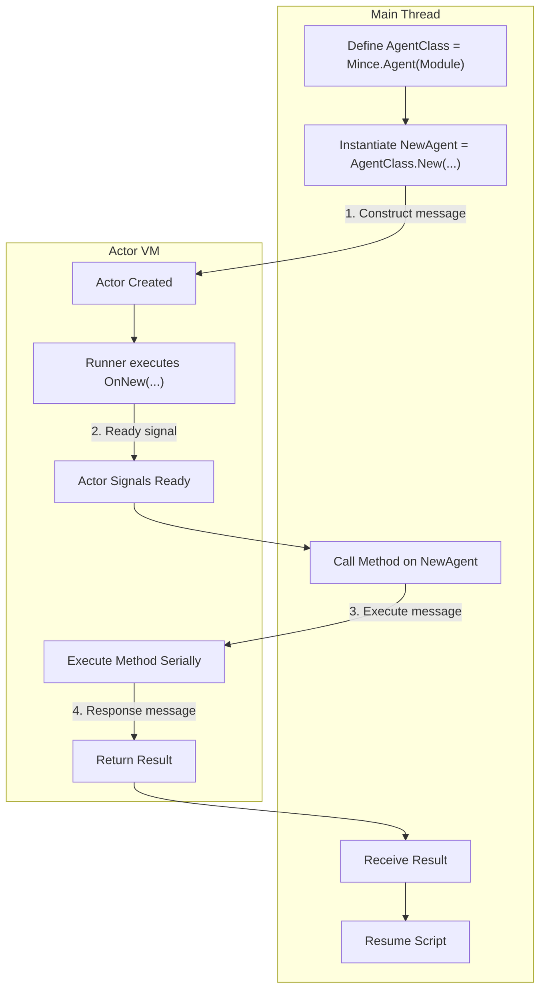

import { Callout } from 'nextra/components'

# Agents (Parallel Entities)

> "I am a specific object with my own brain."

An **Agent** is a stateful, persistent entity. Unlike a Worker, an Agent is not shared. When you create a new Agent, Mince spawns a **dedicated Actor** specifically for that object. This creates a **1-to-1 relationship**: one agent instance on the main thread corresponds to exactly one actor running in a separate VM.

This makes Agents perfect for objects that need to manage their own internal state and run their own logic independently. With the ability to assign instances directly to an agent, they can become truly autonomous, controlling models and other objects without needing constant communication with the main thread.

### Execution Model: Not Automatically Parallel
While the agent lives in a separate VM, when you call a method on an agent proxy, the execution happens **serially within the actor's VM**. The main thread script yields until the actor function completes and returns a value.

To achieve true parallelism, the code *inside* your agent's methods must manage its synchronization, such as `RunService.Heartbeat:ConnectParallel()` or `task.desynchronize()`.

## Interacting with Instances

While you cannot pass instances as arguments, you can give an agent control over an instance using a special method.

### `Agent:AssignInstance(Identifier, Instance)`
This method bridges the gap between the main thread and the actor's VM. It takes a string `Identifier` and an `Instance` reference. Under the hood, Mince creates an `ObjectValue` that the actor can safely access. You can remove the reference by calling the method again with `nil` as the `Instance`.

Inside the agent's code, the instance can then be accessed from a special `self.Instances` table: `self.Instances[Identifier]`.

<Callout>
  The `AssignInstance` method is the **only** supported way to give an agent access to a DataModel instance. Do not attempt to pass instances in `.New()` or other methods.
</Callout>

### Using Shared Tables
Like Workers, Agents can also have a `Shared` table for thread-safe communication. If you define a `Shared` table in your agent's module, Mince will create it **once** when `Mince.Agent(Module)` is called.

This single `Shared` table is then shared across **all** agents created from that definition. This is a powerful feature for allowing agents of the same "class" to communicate with each other, or for the main thread to observe the collective state of an entire group of agents.

The `Shared` table is accessible on the agent proxy object (e.g., `MyAgent.Shared`).

## The Agent Module

This example shows how a `Shared` table can be used to track a collective value across multiple agents.

```lua
local RunService = game:GetService("RunService")
local FishAgent = {
    -- This table is created ONCE when Mince.Agent(script.FishAgent) is called.
    -- It is shared by ALL agents created from this definition.
    Shared = {
        TotalDistanceTraveledByAllFish = 0,
        FishCount = 0,
    }
}

-- Runs ONCE inside the new actor after .New() is called.
function FishAgent:OnNew(SwimSpeed)
    self.Speed = SwimSpeed
    self.Target = Vector3.new() -- Initialize Target
    
    SharedTable.increment(self.Shared, "FishCount", 1) -- Track how many fish exist

    self.Connection = RunService.Heartbeat:ConnectParallel(function(DeltaTime)
        self:OnStep(DeltaTime)
    end)
end

function FishAgent:SetTarget(NewTarget)
    self.Target = NewTarget
end

function FishAgent:OnStep(DeltaTime)
    local Model = self.Instances and self.Instances.Model
    if not Model or not Model.PrimaryPart then return end

    local CurrentPosition = Model.PrimaryPart.Position
    local Direction = (self.Target - CurrentPosition)
    local Distance = self.Speed * DeltaTime

    if Direction.Magnitude > 1 then
        Model:SetPrimaryPartCFrame(CFrame.new(CurrentPosition + Direction.Unit * Distance))
        
        -- Add to the collective distance traveled
        SharedTable.increment(self.Shared, "TotalDistanceTraveledByAllFish", Distance)
    end
end

function FishAgent:OnDestroy()
    if self.Connection then
        self.Connection:Disconnect()
    end
    SharedTable.increment(self.Shared, "FishCount", -1) -- Decrement when destroyed
    print("Agent cleaned up")
end

return FishAgent
```

## Usage (Main Thread)

Because the `Shared` table is common to the agent definition, you can access it to see the state of the whole group.

```lua
local ReplicatedStorage = game:GetService("ReplicatedStorage")
local Mince = require(ReplicatedStorage.Modules.Mince)

-- Create the Factory. This is when the Shared table is created.
local FishAgentFactory = Mince.Agent(script.FishAgent)

-- Create a few agents
local Fish1 = FishAgentFactory.New(5)
Fish1:AssignInstance("Model", workspace.FishModel1)
Fish1:SetTarget(Vector3.new(100, 0, 100))

local Fish2 = FishAgentFactory.New(7)
Fish2:AssignInstance("Model", workspace.FishModel2)
Fish2:SetTarget(Vector3.new(-100, 0, 50))

-- Read the collective state from the shared table
task.delay(5, function()
    local TotalDist = FishAgentFactory.Shared.TotalDistanceTraveledByAllFish
    local Count = FishAgentFactory.Shared.FishCount
    print(`There are {Count} fish. Together, they have traveled {string.format("%.2f", TotalDist)} studs.`)
end)
```

## Agent Lifecycle

The lifecycle of an Agent is explicit and structured, involving a handshake between the main thread and the newly created actor.

1.  **Definition**: `Mince.Agent(ModuleScript)`
    - You first define an "Agent Class" by passing a ModuleScript to the `Mince.Agent` constructor.

2.  **Instantiation**: `AgentClass.New(...)`
    - Calling `.New()` on your definition kicks off the creation process. A new `Actor` instance is created.

3.  **Initialization (Handshake)**
    - The main thread sends a `Construct` message to the actor with any serializable arguments from `.New()`.
    - Inside the actor, a runner script calls the `OnNew` function within your agent's ModuleScript.

4.  **Execution**
    - Your `Agent` variable is a proxy object. When you call a method, the proxy sends a message to the actor and yields.
    - The actor performs the logic **serially** within its VM. To run code in parallel, you must use an explicit API like `:ConnectParallel`.

5.  **Destruction**: `Agent:Destroy()`
    - This cleans everything up, terminating the `Actor` instance.


