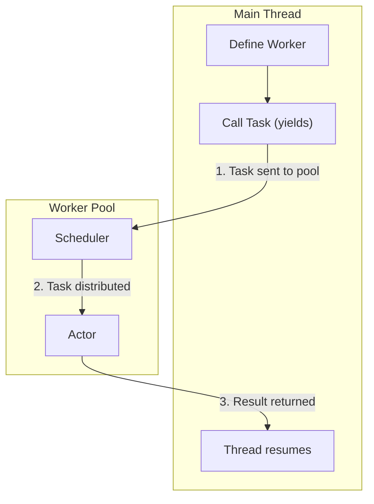

import { Callout } from 'nextra/components'

# Workers (Task Pools)

> "I have a job, I don't care who does it."

A **Worker** is a stateless job processor that manages a pool of actors to execute tasks in parallel. Unlike an Agent, you don't create instances of a Worker. Instead, you define a single Worker pool that **automatically distributes jobs** across a shared set of actors. This makes it incredibly efficient for processing large batches of independent, stateless tasks.

This creates a **many-to-one relationship**: many function calls on the main thread are queued and processed by one pool of actors, running concurrently.

**Use this for:** Pathfinding, procedural generation, data compression, image processing, or any other heavy computation that can be broken down into discrete, stateless jobs.

<Callout>
  Workers live in a separate VM. You **cannot** pass Roblox instances (like Models or Parts) or other memory pointers to a Worker. All communication, including arguments to `.New()` and arguments/return values from methods, must be serializable.
</Callout>

## The Worker Module

This ModuleScript defines the functions that will be run in parallel.

```lua
local Pathfinder = {
    -- The max number of actors this pool can create.
    PoolSize = 16,

    -- Optional: This table is created once and shared by all 16 actors.
    -- It is thread-safe via SharedTable.
    Shared = {
        TotalPathsCalculated = 0,
        CacheHits = 0,
    }
}

-- This function runs inside an actor VM **in parallel**.
function Pathfinder:Compute(StartPosition, EndPosition)
    -- Heavy math logic...
    local Distance = (StartPosition - EndPosition).Magnitude
    
    -- Thread-safe write to the single shared table.
    SharedTable.increment(self.Shared, "TotalPathsCalculated", 1)
    
    task.wait(1) -- Simulating heavy work 
    
    return Distance
end

return Pathfinder
```

## Usage (Main Thread)

Typically, you'll fire off many tasks using `task.defer` and then use `AwaitAll` to sync them.

```lua
local ReplicatedStorage = game:GetService("ReplicatedStorage")
local Mince = require(ReplicatedStorage.Modules.Mince)

-- Creates the worker pool proxy. No actors exist yet.
local Pathfinder = Mince.Worker(script.Pathfinder)

function StartBatch()
    print("Starting calculations...")

    -- 1. Fire off multiple tasks rapidly using task.defer.
    -- These are added to the worker's queue and run concurrently across the actor pool.
    for i = 1, 50 do
        task.defer(function()
            local Result = Pathfinder:Compute(Vector3.zero, Vector3.new(i, 0, 0))
            print(`Path {i} Result: {Result}`)
        end)
    end
    
    -- 2. Wait for all 50 tasks to finish before proceeding.
    Pathfinder:AwaitAll()
    
    print("All paths calculated!")
    print(`Total processed: {Pathfinder.Shared.TotalPathsCalculated}`)
end
```

## Worker Lifecycle and Pooling

The Worker's lifecycle is designed for efficiency and is mostly automatic. The key is its ability to lazily create actors and distribute tasks among them. Here is a simplified overview of a single task's journey:

1.  **Definition**: `Mince.Worker(ModuleScript)`
    - You define the Worker by passing a ModuleScript. This creates the central **proxy object** for the pool but does **not** create any actors yet.
    - At this stage, you can define a `PoolSize` (defaults to 16) and a `Shared` table in your ModuleScript.

2.  **Initialization (Lazy)**
    - The first time you call a method on the worker proxy (e.g., `MyWorker:DoWork()`), the pool initializes. A container folder is created to hold the actors.

3.  **Execution (Task Queuing and Distribution)**
    - Every time you call a method on the proxy, the task is added to an internal **request queue**, and the main thread script yields.
    - The Worker's internal scheduler automatically distributes tasks from the queue to actors based on a set of rules, as illustrated below:
    
    ```mermaid
    graph TD
        subgraph "Worker Scheduler Logic"
            A["Task in Queue"] --> B{"Idle Actor Available?"}
            B -- Yes --> C["Assign to Idle Actor"]
            B -- No --> D{"Pool Full?"}
            D -- No --> E["Create New Actor"]
            D -- Yes --> F["Assign to Next Actor (Round-Robin)"]
            C --> G["Actor Executes Task"]
            E --> G
            F --> G
        end
    ```
    - When the actor finishes the job, it sends the result back, and the waiting script on the main thread is resumed.

4.  **Synchronization**: `Worker:AwaitAll()`
    - This special method allows you to wait for all currently running tasks to finish. It yields your script and resumes it only when the active task count for the pool drops to zero.

